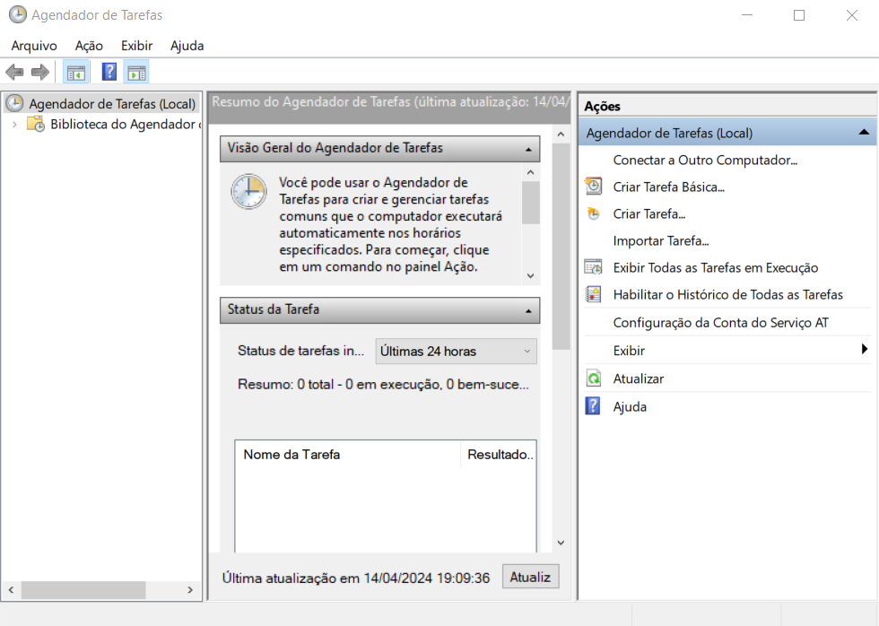

# AutomAi - Automação de presença no Adalove - Inteli

## Descrição
Este script de automação foi desenvolvido para facilitar o registro diário de presença na plataforma Adalove do Inteli. Através de um conjunto de ações automatizadas, o script simula o processo que um usuário faria para realizar o check-in na plataforma, desde o login com as credenciais até a confirmação de presença. Ideal para estudantes que estão cansados de perder presença por esquecer de fazer um processo manual e cansativo de vários cliques todo dia. Seja o engenheiro, não o robô.

## Guia de Instalação

## Pré-requisitos
- Python 3.6 ou superior.
- Selenium WebDriver para Chrome.
- Navegador Google Chrome instalado.

## Instruções de Instalação
1. Clone o repositório ou baixe o arquivo `.py` para o seu computador.
   - É aconselhável que clone o repositório, visto que a plataforma Adalove é constantemente atualizada, o que pode ocasionar do script ficar defasado. Nesse sentido, eu atualizarei constantemente no github.
2. Tendo o Python instalado, é preciso instalar a biblioteca Selenium com pip:
``` python
pip install selenium
```

## Guia de Uso

### Configuração
1. Modifique as variáveis `email` e `senha`, respectivamente na linha 16 e 17 do arquivo `.py`, com suas credenciais de login na plataforma Adalove:
```
email = seuemail@exemplo.com
senha = suasenha
```

### Execução do Script
1. Abra o terminal ou prompt de comando.
2. Navegue até o diretório onde o script foi salvo.
3. Execute o script com o comando:
``` python
python automacao_adalove.py
```

### Agendamento
- O script faz todo o processo de presença, mas para que seja tudo automático, precisamos configurar para que o script seja executado automaticamente em um horário específico. Você pode agendá-lo usando o Agendador de Tarefas do Windows ou o cron no Linux/Mac (nesse tutorial mostraremos apenas a configuração do Agendador de Tarefas do Windows).

**Agendador de Tarefas do Windows:**
1. Abra o Agendador de Tarefas

1. Na barra superior que contém 'Arquivo', 'Ação', 'Exibir' e 'Ajuda':
   1. clique em 'Ação'
   2. clique em 'Criar Tarefa'

1. Defina o nome da automação e preencha no campo 'Nome:'
   - Nesse exemplo utilizaremos 'automacao_adalove'.
2. Em 'Opções de segurança', logo em baixo da Descrição dentro da aba inicial 'Geral':
   1. clique em "Executar com privilégios mais altos

1. Agora definiremos o horário que o script será acionado. Na barra superior:
   1. clique em 'Disparadores'
   2. clique em 'Novo...'
   3. Abrirá uma nova aba chamada 'Novo Disparador':
      1. Nas configurações, clique em diário
      2. Configure o horário de inicialização para o horário da sua primeira presença.
      3. 
   4. Repita o passo anterior 2 vezes, clicando em 'Novo...' e definindo os outros horários de presença do dia.
   5. 
2. Agora definiremos o script a ser executado. Na barra superior:
   1. clique em 'Ações'
   2. clique em 'Novo...'
   3. Abrirá uma nova aba chamada 'Nova Ação':
      1. 
      2. Na opção de 'Programa/script', clique no botão 'Procurar...'
      3. Procure e selecione o script Python de automação que você obteve a partir deste repositório (arquivo `automacao_adalove.py`)
      4. Clique em 'OK'.
3. Agora arrumaremos algumas configurações das condições do script a ser executado. Na barra superior:
   1. clique em 'Condições'.
   2. Desabilitar a opção 'Iniciar a tarefa somente se o computador estiver ligado na rede elétrica'
   3. Habilite 'Reativar o computador para executar esta tarefa'
   4. Caso queira que o agendador só inicie quando estiver no Inteli, habilite a opção 'Iniciar somente se a seguinte conexão de rede estiver disponível' e selecione o Wi-fi do Campus.
   5. 
4. Clique em 'OK'.
5. Parabéns, você acabou de configurar o seu agendamento das presenças do inteli.
   

## Contribuição / Contato
Contribuições são bem-vindas! Se você tiver uma sugestão para melhorar este script, por favor, faça um fork do repositório e crie um pull request, ou abra uma issue com a tag "melhoria". Se preferir, pode me contatar por e-mail: tony.sousa@sou.inteli.edu.br.